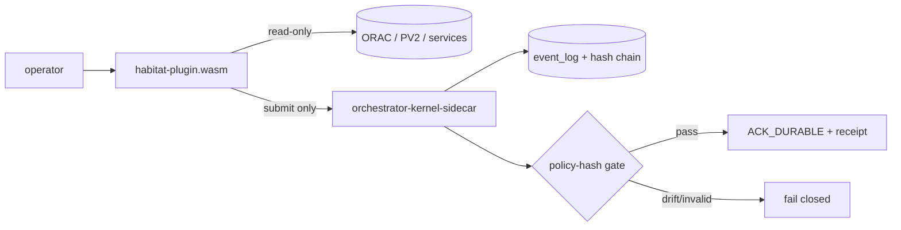

# Architecture Schematics

> Back to: [[MOC]] · [[HOME]] · in-repo [docs/ARCHITECTURE](../docs/ARCHITECTURE.md)

A Rust workspace with a Zellij WASM plugin at the edge and a durable sidecar
behind the admission boundary.

## The 5 crates

| Crate | LOC | Role |
|---|---|---|
| `habitat-core` | ~1,650 | Shared contracts: the `HabitatModule` trait, event types, config parse + validation, render primitives, response structs. |
| `habitat-modules` | ~4,400 | The 11 dashboard modules — isolated state, event handling, rendering, tests. |
| `habitat-bridge-client` | ~656 | The only WASM-safe HTTP path: polls services via `run_command(curl …)`, fans out tagged `BridgeData` events. |
| `habitat-plugin` | ~535 | WASM entrypoint (`wasm32-wasip1`). Wires modules + bridge, handles Timer/Key/Pipe, formats sidecar responses. |
| `orchestrator-kernel-sidecar` | ~2,180 | The durable engine: event log, hash chain, idempotency, policy warrants, recipe execution. Ships `orch-kernelctl` + `orch-kerneld`. |

## Runtime planes

```text
operator
  |
  v
Zellij pane / pipe
  |
  v
habitat-plugin.wasm  ---- read-only curl probes ----> ORAC / PV2 / 14 services
  |
  | kernel submit ONLY
  v
orch-kernelctl / orchestrator-kernel-sidecar
  |
  v
durable event log + hash chain + replay verification (SQLite WAL)
```

## Authority split (the core idea)



The WASM plugin can *observe* infinitely cheaply but can never *durably act*.
Durability is defined narrowly — `ACK_DURABLE` only exists **after** event append
+ hash-chain update + idempotency resolution + policy warrant.

## The WASM constraint

`habitat-plugin` depends on `zellij_tile` → compiles **only** to
`wasm32-wasip1` → cannot run host `cargo test`. Consequence:

- All testable logic lives in `habitat-core` / `habitat-modules` /
  `habitat-bridge-client`, which **must not import `zellij_tile`**.
- The gate tests those three crates by name; `build.sh` is the plugin crate's
  only verification step.
- Bridge HTTP is done via `run_command(curl …)` — the only WASM-safe HTTP path.

## Build profile

`opt-level = "s"`, `lto = true`, `strip = true` → ~1.2 MB wasm artifact at
`~/.config/zellij/plugins/habitat-plugin.wasm`. Cargo target dir pinned to
`/tmp/habitat-zellij-target` to avoid workspace pollution.

## See also

- [[Orchestrator Kernel Sidecar — Durable Admission Engine]] — what lives behind the boundary
- [[Dashboard Modules]] — what lives at the edge
- [[Command Surface]] — how the two are driven
