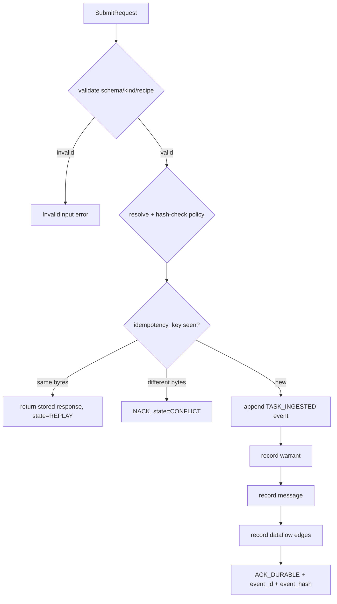

# Orchestrator Kernel Sidecar — Durable Admission Engine

> Back to: [[MOC]] · [[Architecture Schematics]] · source `crates/orchestrator-kernel-sidecar/src/lib.rs` (~1,980 LOC)

The substantive engine. An **append-only, hash-chained event log** with durable
admission semantics. Implemented and tested in `lib.rs`.

## Storage

- **SQLite WAL**: `journal_mode=WAL`, `busy_timeout=5000`, `synchronous=NORMAL`,
  `foreign_keys=ON`.
- **8 tables**: `event_log`, `messages`, `pane_snapshots`, `warrants`,
  `recipe_runs`, `recipe_run_warrants`, `edge_coherence`, `idempotency_records`.
- State dir resolves from `ORCH_KERNEL_STATE_DIR`, else
  `Orchestrator/operator-kernel/state` under the workspace root.

## Hash chain

Each event hashes `sha256(prev_hash ‖ canonical_event_json)`, seeded from a fixed
genesis hash `sha256:habitat.kernel.event_log.genesis.v1`.

`verify_chain()` walks the entire log checking, per row:
1. **seq monotonicity** (expected `1..` sequence);
2. **prev-hash linkage** (row's `prev_hash` == prior row's `hash`);
3. **hash recomputation** (recompute and compare).

Canonical JSON recursively **sorts object keys** so hashes are deterministic
regardless of input key order.

## Durable submit — the core write path

`submit(SubmitRequest) → SubmitResponse`, wrapped in `BEGIN IMMEDIATE` →
`COMMIT`/`ROLLBACK` (atomic). Flow:

### Verdicts (`SubmitVerdict`)
- `ACK_DURABLE` — event appended, hash returned.
- `NACK` — rejected before durable admission.

### Idempotency (`IdempotencyState`)
- `NEW` — newly admitted.
- `REPLAY` — same key + same canonical request → returns stored response.
- `CONFLICT` — same key, different canonical bytes → `NACK` / `REJECTED`.

## Policy-bound warrants

Every admission resolves a `PolicyConfig` from JSON (path via
`ORCH_KERNEL_POLICY_PATH`, default `config/zellij-orchestrator-kernel-warrants.v2.json`)
and validates it **two ways before any write**:

1. `policy_hash` must equal the hardcoded expected digest
   `sha256:e9015f7850bc3d8528e500f2dfee999d61c03334dc0939802f74db7f1167ac73`;
2. recompute the canonical hash of the config **with the `policy_hash` field
   nulled** and compare — drift in either fails closed.

A `warrant` row is written with `decision_before_execution = 1` for every admit.

## Recipe execution — fixed no-shell allowlist of ONE

The only built-in recipe is `verify_chain`. Any other `requested_recipe` is
rejected at validation **and** at policy resolution. There is **no arbitrary
shell or network path** — by construction, not by sanitization. When requested,
`verify_chain` re-walks the chain and emits `RECIPE_RUN_STARTED` →
`RESULT_VERIFIED` events, a `recipe_runs` row, and links a warrant.

## Edge coherence & fitness

The kernel records the dataflow edges as MEASURED facts:
`submit_to_event → event_to_warrant → warrant_to_run → run_to_result →
result_to_replay_dashboard`.

`snapshot_v2()` projects a dashboard-truth contract with a fitness score:
- `0.0` — chain broken (`dominant_loss = durable_admission_integrity`);
- `0.74` — required edges missing (`dominant_loss = edge_coherence`);
- `0.80` — nominal (`dominant_loss = pipe_terminality`).

## Admission vs execution (design stance)

`submit` durably records *intent* (a `TASK_INGESTED` event + warrant + message +
edges) and returns `ACK_DURABLE` — but **does not run anything**. The only
built-in recipe just re-verifies the chain. This is a deliberate MVP: prove the
durable-receipt substrate is sound **before** wiring real effectors.

`orch-kerneld` is currently a **stub** — it prints a snapshot; the long-lived UDS
server is an explicit later P2.0 increment. See [[Task Status & Roadmap]].

## See also

- [[Command Surface]] — `orch-kernelctl` subcommands that drive this engine
- [[Security & Admission Boundary]] — the fail-closed rules
