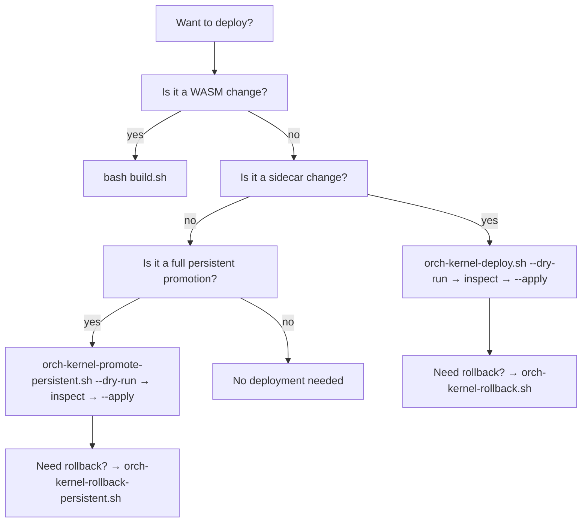

# Build Deploy Rollback Pipeline

> Back to: [[MOC]] · [[Diagnostics]] · [[Command Surface]]
> Source: `build.sh` · `scripts/orch-kernel-deploy.sh` · `scripts/orch-kernel-rollback.sh`
> `scripts/orch-kernel-promote-persistent.sh` · `scripts/orch-kernel-rollback-persistent.sh`

The plugin and sidecar have **separate deploy pipelines** — the WASM artifact
(`build.sh`) and the host binary (`orch-kernelctl`). Both use dry-run/apply
guards and arming-key checks.

---

## 1. WASM Plugin — `build.sh`

Builds `habitat-plugin` for `wasm32-wasip1` and deploys to
`~/.config/zellij/plugins/`.

```bash
CARGO_TARGET_DIR=/tmp/habitat-zellij-target \
  cargo build --target wasm32-wasip1 --release -p habitat-plugin
```

**What it does:**
1. Builds the WASM release binary
2. `/usr/bin/cp -f` to `~/.config/zellij/plugins/habitat-plugin.wasm`
3. `/usr/bin/cp -f` to `~/.config/zellij/plugins/habitat-plugin-vX.Y.Z.wasm`
4. `zellij action start-or-reload-plugin` for hot-reload if a session is active

> ⚠️ Uses `/usr/bin/cp -f` — never bare `cp` (alias = `trash`, silently no-ops).

**Force live replacement** (for upgrading a running pane in-place):
```bash
zellij plugin --skip-plugin-cache --in-place --close-replaced-pane \
  --configuration modules=orchestrator_kernel \
  --configuration role=orchestrator_kernel \
  --configuration sidecar_cli=/home/louranicas/.local/bin/orch-kernelctl \
  --configuration kernel_poll=5 \
  -- file:~/.config/zellij/plugins/habitat-plugin-v0.1.2.wasm
```

---

## 2. Sidecar Binary — `scripts/orch-kernel-deploy.sh`

Builds and deploys `orch-kernelctl` to `~/.local/bin/`.

```bash
# Dry-run (default — safe to call any time)
scripts/orch-kernel-deploy.sh --dry-run

# Live deploy (requires arming key)
scripts/orch-kernel-deploy.sh --apply
```

**Arming gate:** reads `atuin kv get factory.authorize.zellij-orchestrator-kernel`.
Exits 3 if not `"armed"`. Luke @ node 0.A is sole authority to set this key.

**Deploy steps (apply mode):**
1. `cargo build -p orchestrator-kernel-sidecar --bin orch-kernelctl`
2. `install -m 0755 "$DEST" "$DEST.bak"` (backup existing binary)
3. `install -m 0755 "$BIN" "$DEST"` (atomic install)

**Rollback:** `scripts/orch-kernel-rollback.sh --apply`

```bash
# Restores ~/.local/bin/orch-kernelctl from orch-kernelctl.bak
install -m 0755 "${DEST}.bak" "${DEST}"
```

Both scripts are **dry-run by default** — calling without `--apply` is always
safe. `--dry-run` prints the plan without executing.

---

## 3. Persistent Promotion — `scripts/orch-kernel-promote-persistent.sh`

Promotes the full deployment: WASM binary, versioned WASM, layout, Zellij
config. Produces a **timestamped receipt directory** with before-state backups
and a `promotion.json`.

**Deployment artifacts promoted:**
- `~/.config/zellij/plugins/habitat-plugin.wasm` (canonical name)
- `~/.config/zellij/plugins/habitat-plugin-v0.1.2.wasm` (versioned)
- `~/.config/zellij/layouts/synth-orchestrator.kdl`
- `~/.config/zellij/config.kdl`

**Receipt schema:**
```
"schema": "habitat.kernel.persistent.promotion.v1"
"framework": "ai_docs/ZELLIJ_ORCHESTRATOR_KERNEL_DEPLOYMENT_FRAMEWORK_S1008736.md"
```

Dry-run by default; apply mode requires:
- `HABITAT_PLUGIN_WASM` env or default target path to exist
- Arming key `factory.authorize.zellij-orchestrator-kernel = "armed"`

---

## 4. Persistent Rollback — `scripts/orch-kernel-rollback-persistent.sh`

```bash
scripts/orch-kernel-rollback-persistent.sh <receipt-dir>
```

Restores all 4 artifacts from `.before` files in the receipt directory.
Writes a `rollback.json` receipt.

```bash
restore_if_present "${RECEIPT_DIR}/habitat-plugin.wasm.before" \
  "${LEGACY_WASM_DEST}" "0755"
# + versioned-wasm, layout, config.kdl
```

**Design:** rollback is always safe to call because it only restores files
that have a `.before` backup. Missing backups are logged and skipped.

---

## Deployment decision tree



---

## Receipt locations

All timed receipts land in `<workspace>/receipts/`:

| Script | Receipt path |
|---|---|
| `orch-kernel-promote-persistent` | `receipts/orch-kernel-persistent-promotion-<stamp>/promotion.json` |
| `orch-kernel-rollback-persistent` | (inside the promotion receipt dir) `rollback.json` |
| `orch-kernel-v012-live-pipe-proof` | `receipts/orch-kernel-v012-live-pipe-proof-<stamp>/summary.json` |
| `orch-kernel-v012-zero-touch-verify` | `receipts/orch-kernel-v012-zero-touch-verify-<stamp>/summary.json` |

---

## See also

- [[Command Surface]] — `orch-kernelctl` CLI subcommands
- [[Diagnostics]] — gate matrix + proof script reference
- [[Release & Provenance]] — v0.1.2 identity and publish steps
- [[notes/Score & Fitness Framework]] — scoring deployed artifacts
