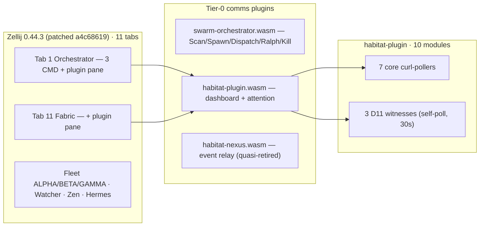
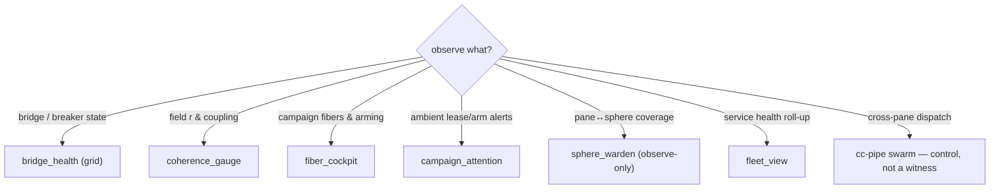

# Plugin in Habitat Context (Factory Map)

> Back to: [[MOC]] · external: `[[Factory Map — Zellij L0 & Witness Plugins (S1008584)]]`

How `habitat-plugin.wasm` sits inside the live ULTRAPLATE Habitat session.
Source: Factory Map deep-dive S1008584, drift-checked 2026-06-24.

## The live session topology

**14 deployed `.wasm` plugins** in total. 3 are comms channels (above); the
rest are UI/utility only (ghost, harpoon, monocle, multitask, room, zjstatus,
etc.). `habitat-nexus.wasm` is retained as a fallback but is quasi-retired.

## Live status panels (the screenshot evidence, S1008584)

| Module | Type | Live readout |
|---|---|---|
| `bridge_health` | core (curl) | ALL UP 16/16 · T=0.498 · BRIDGES 6/0/0 |
| `coherence_gauge` | core (curl) | r≈0.93 · coupling · Hebbian |
| `fiber_cockpit` | D11 witness | FIBER 32 campaigns / 64 leases |
| `campaign_attention` | D11 witness | 4 campaigns · armed:0 |
| `sphere_warden` | D11 witness | WARDEN panes 16 / spheres 5 / **gap 11** |

The `gap 11` on `sphere_warden` = 16 Zellij panes but only 5 registered PV2
spheres. The closure path (`pane-vortex-ctl register`) is gated — warden
never auto-registers. See `[[Factory Map — PV2 Kuramoto Field (S1008584)]]`.

## Decision map — "what do I want to observe?"

## Relationship to `habitat-nexus`

`habitat-plugin` is the successor (see PLAN.md §1):

| Axis | `habitat-nexus` (retired) | `habitat-plugin` (this) |
|---|---|---|
| Source | single `main.rs` (~2641 LOC) | 4-crate workspace, trait-based |
| Testability | monolithic, zero test isolation | tests in host crates (WASM-free) |
| Polling | parallel `web_request` | `run_command(curl)` per DataSource |
| Pipe API | 6 commands | 3 commands (snapshot/query/status) |
| NA compliance | implicit | explicit (S1/S4/S6/S7/S8/S9/S11/S12) |

`habitat-nexus.wasm` stays on disk as a rollback anchor; `habitat-plugin`
supersedes it per the deployment assessment (G-2 closed by PLAN.md).

## Drift notes (S1008584 check vs older docs)

- Tests: old docs said 163 — live at drift-check was **340** (now 365 at v0.1.2 seal).
- WASM size: v0.1.0 backup = 1.2 MB; live deployed at drift-check = **1.3 MB**.
- Module count: **10 total = 7 core + 3 D11 witnesses** (not "7 modules" as
  some earlier notes stated).

## See also

- [[Dashboard Modules]] — the 10 modules, sources, keybinds
- [[Architecture Schematics]] — crate map and WASM boundary
- [[notes/Bridge Client & Polling Engine]] — how polling works
